# BarrowCorp Security

You've just been recruited into the BarrowCorp Security Company, purr-veyors of anti-vermin security. The founders, Bonnie and Clyde, are also the primary first responders. But with a recent uptick of new business, they are having trouble getting the requisite number of cat naps! They need a better solution. 
Fortunately, you are familiar with the xMatters platform and its powerful on-call alerting capabilities. Coupled with the Twilio platform, you can lead BarrowCorp Security Company into a new era of vermin extermination. 
Follow along as we set up an inbound phone number for hapless residents to call and enter details about the specific breed of vermin they've encountered. xMattersh will then quickly dispatch a BarrowCorp security representitive to the scene and save the day!

# Pre-Reqs

1. Basic knowledge of javascript
2. Twilio account and credits

# Implementation

## Free xMatters?!

First, we'll need to sign up for a free trial of xMatters. Head over to [xMatters.com](https://xmatters.com) and click the **Try It Free** button. Enter your name and email address. Choose a company name that makes sense to you, select the region, and then click **Get Started**. A few moments later, an email will arrive confirming your account. The server-side squirrels will run really fast and get your account created, and you'll be logged in with a welcome message. Feel free to run through the welcome tour, or choose to skip it for now. Don't worry - you can come back to it later. 

xMatters Free gives you 10 users to notify across email and mobile push notifications. [Upgrade to get SMS, voice, and more!](https://www.xmatters.com/pricing/) 

## Onboard the cats
Before we can start notifying our fiesty felines, we need to get them created in xMatters. 

Head over to the Users page by clicking the Users icon in the left menu. 
<kbd>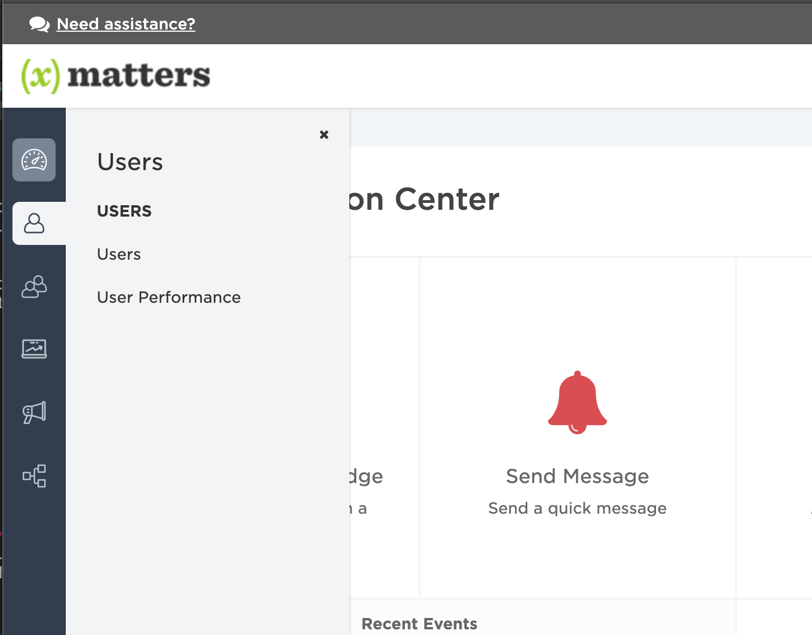</kbd>

Click the **Invite Users** button in the upper right and enter the following:

| First Name | Last Name | Email | Phone | Role |
| ---------- | --------- | ----- | ----- | ---- |
| Clyde | Barrow | clyde@email.barrowcorp.xmatters.com | | Standard User |
| Bonnie | Parker | bonnie@email.barrowcorp.xmatters.com | | Standard User |

Then click **Send Invitations**. These invitation emails will be sent into the ether, but that's fine - we don't need them. In the background, the users have been created and we're prompted to add them to a group....

## Herd the cats

Click the **Add to Group** button and a new screen will prompt you to capture the group details. Give it a helpful name like **On Site Security**, then click **Create**. 

<kbd>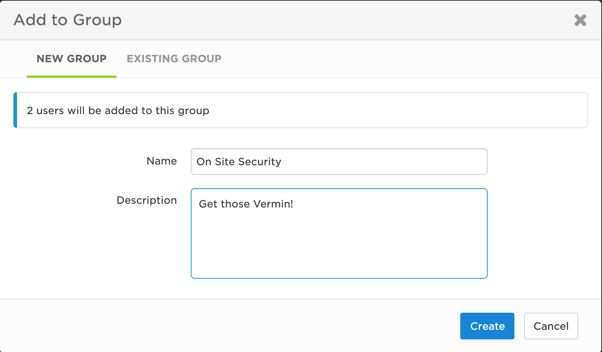</kbd>

Heading over to the **Groups** page, we see a warning icon on our group. This means we need to add the new security cats to their on-call schedules. 

<kbd>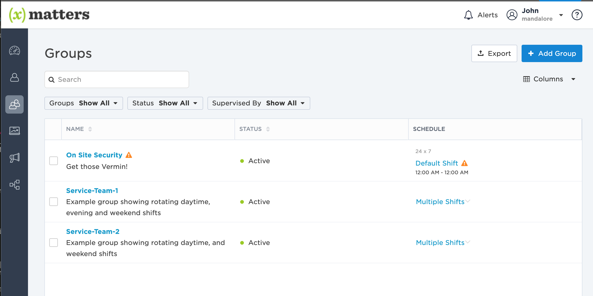</kbd>

So, click the **On Site Security** group to display its details. The **Calendar** tab is laid out like an Outlook calendar and even has easy-to-use drag handles for setting up the shifts. For the purposes of BarrowCorp, we'll use one Default Shift, but other organizations might want to use day time, night time and weekend shifts depending on their schedules.  

<kbd>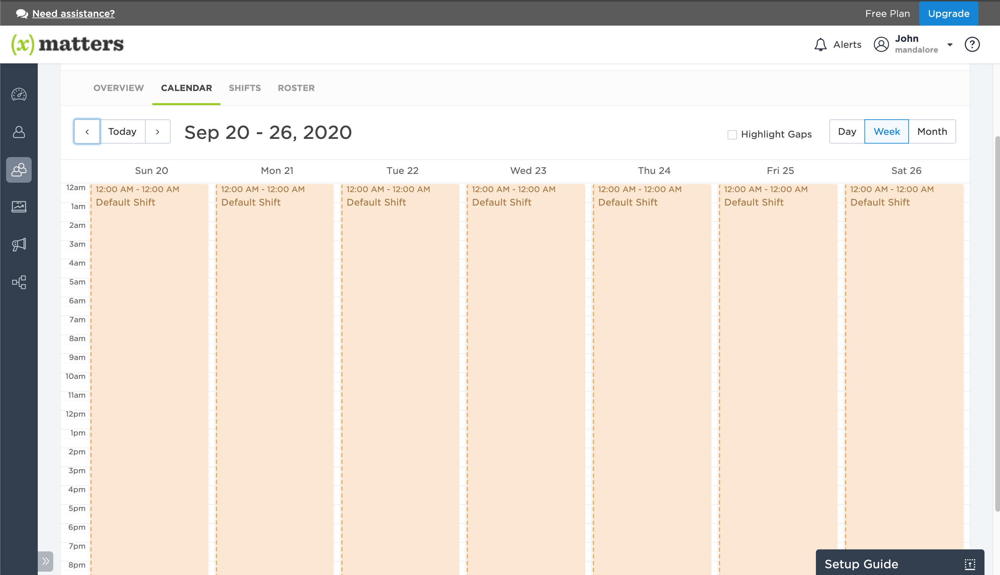</kbd>

Click on the **Default Shift** and click the **Add Escalations**. This is how we will associate the users to the shift. Add Clyde and Bonnie by typing their names into the recipients field and then clicking them when they appear in the list. Click the clock icon beside the second member in the group so you can add a 5 minute escalation delay, and then click **Save Changes**. 

<kbd>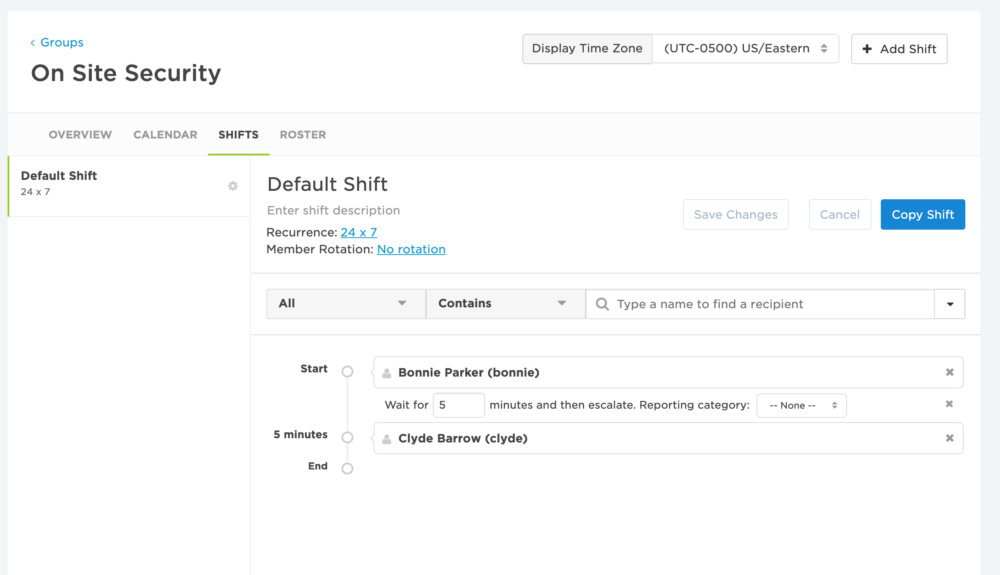</kbd>

Click the **No Rotation** link to view the different types of rotations. Potentially, Clyde will be upset for always being the one as first on-call, so rotations allow for an automatic rotation to change things up. Select **Event Based** and click **Save Changes**. 

<kbd>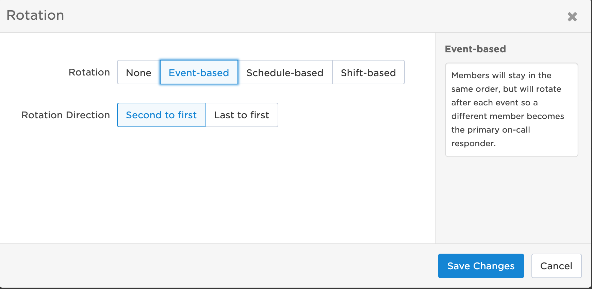</kbd>

With the 5 minute escalation and rotations in place, our feline security guards can get their required number of nap minutes per day.  

## Integrate ALL THE THINGS! Part 1

This section deals with setting up the integration in xMatters to receive the REST call from Twilio to generate an event for notifying the On Site Security Group. 

First, download the [TwilioIntegrations.zip](TwilioIntegrations.zip) file to your local machine, and then navigate to the **Workflows** page in xMatters using the left menu. 

<kbd>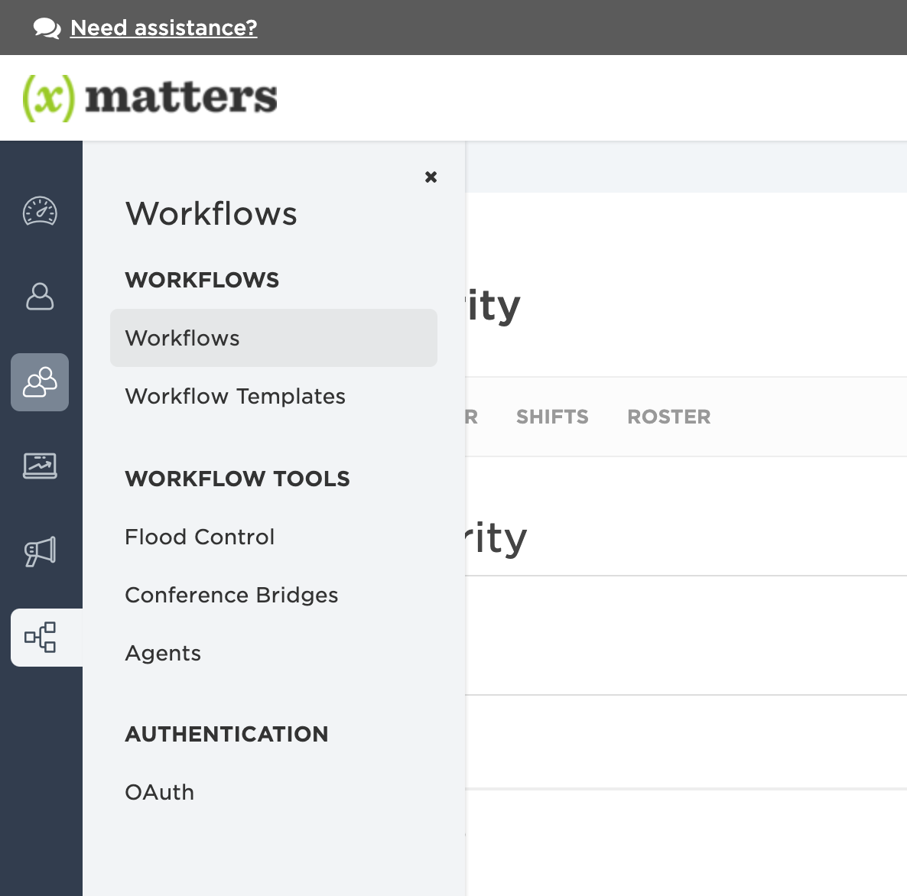</kbd>

Click the **Import** button and import the zip file you downloaded. This workflow holds the message templates and integration logic for parsing the request from Twilio to generate the notifications to the cats. After the import finishes, open the workflow and navigate to the Flows tab. Flows are where all the action is. Click on the **Vermin Alert** flow to display the canvas. 

<kbd>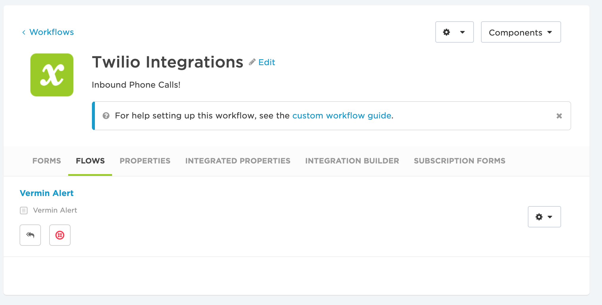</kbd>

The canvas has several steps on it and is pretty ready to go. You can double-click each step to see the mapping of the outputs from the upstream steps to the downstream steps. For now, we need the inbound URL for the HTTP Trigger. Double-click the **Vermin Alert - Inbound from Twilio** step with the Twilio logo to open its Settings tab. 

<kbd>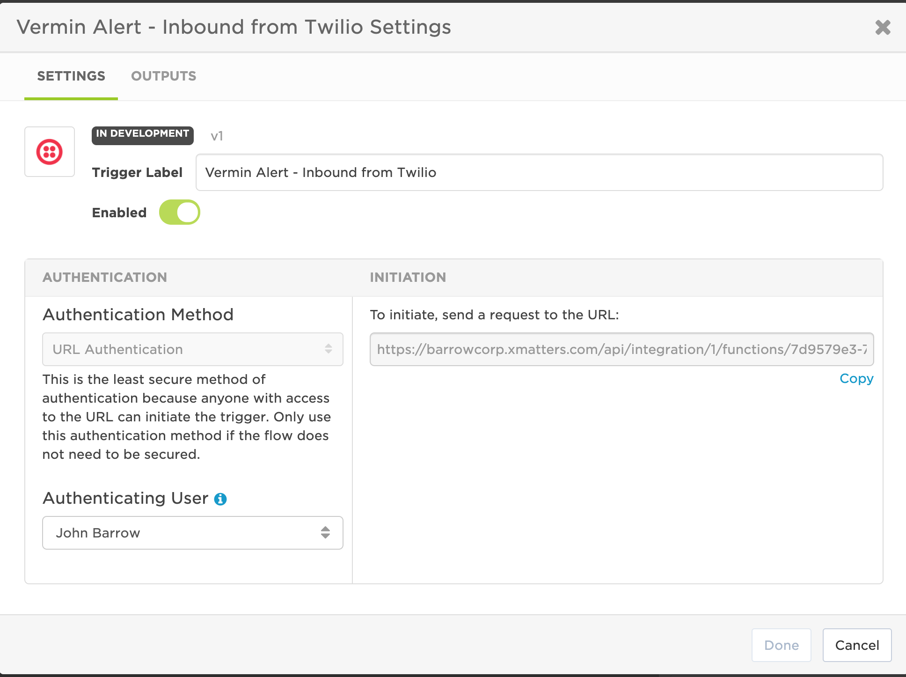</kbd>

Copy the URL to a safe spot as we'll need that later. This HTTP Trigger is set for URL authentication, which means the `apiKey` value is tacked onto the end of the url. Other options are Basic auth and OAuth for systems that support those. Since this is just a fun workshop, we'll keep the apiKey as is. 

## Integrate ALL THE THINGS! Part 2

Log in to your Twilio account and open the **Functions** section.

<kbd>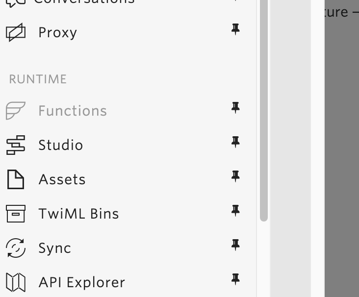</kbd>

We'll wrap all this into one single service, so click the **Create Service** button and give it a handy name, like **barrowcorp**. From the service page, add each of the following functions with the indicated name and paste in the linked script. 

* [welcome](welcome.js)
* [xm_trigger_event](xm_trigger_event.js)
* [handle_transcribe](handle_transcribe.js)

Then, add an environment variable called `XM_URL` and paste in the HTTP Trigger url from the [xMatters](#integrate-all-the-things-part-1) section above. 

After creating, pasting, and adding, your service should look something like this:

<kbd>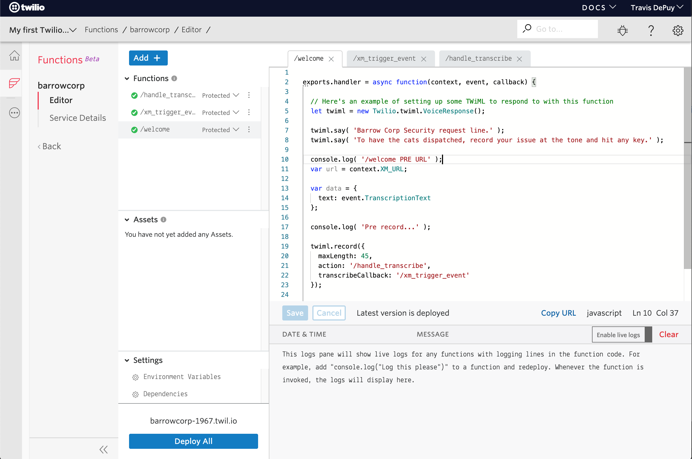</kbd>

If that looks about right, hit the **Deploy All** button to package and build the functions on the Twilio platform. 

The last piece of all this high-tech infrastructure is the phone number. So, in the **All Products and Services** menu, click **Phone Numbers**, then **Buy A Number**. Click the **Voice** box and any particular digits you'd like included in the number, then click **Search**. 

<kbd>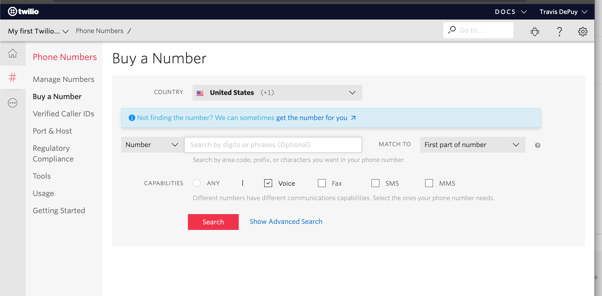</kbd>

Select a number and click **Buy**. This will be the number our hapless consumers will use to get help from BarrowCorp. Then, scroll down to the **Voice & Fax** section and in the **A Call Comes In** section, select `Function`, the service you created above, `ui`, and `/welcome` as the function path:

<kbd>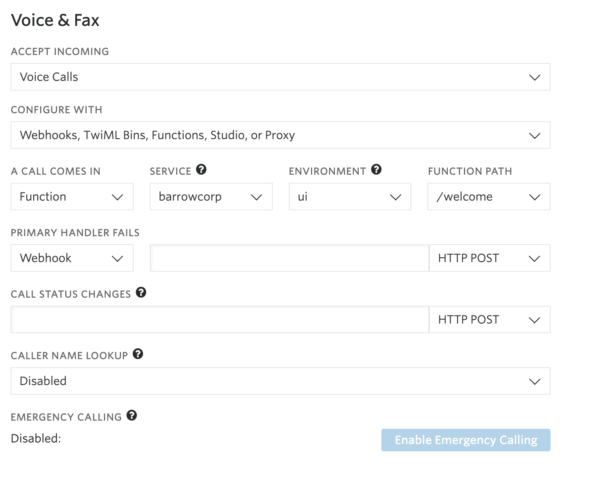</kbd>

This associates the function to the phone number so that when calls come in to this number, the function is kicked off, initiating a voice recording and an API call to the xMatters workflow to dispatch the **On Site Security** team to fearlessly defend your property from assorted vermin. Unless they are napping. In which case you are on your own. I recommend Super Soaker&trade; for best results. 

## Test!

Everything should be hooked up at this point. In the Twilio functions, flip the switch to live tail the logs and dial the phone number you created above. As the system processes your call, you will see the various statements roll buy. 

<kbd>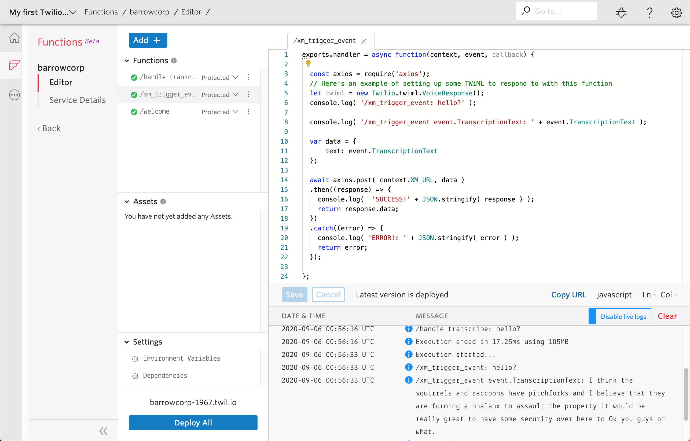</kbd>

Record your local Vermin disturbance and hit a digit. Make sure it is more than 2 seconds long as Twilio requires at least 2 seconds to initiate the recording. 

Similar to the Live Logs in Twilio, the Activity Stream in xMatters displays the step execution and any errors that may have occurred. 

<kbd>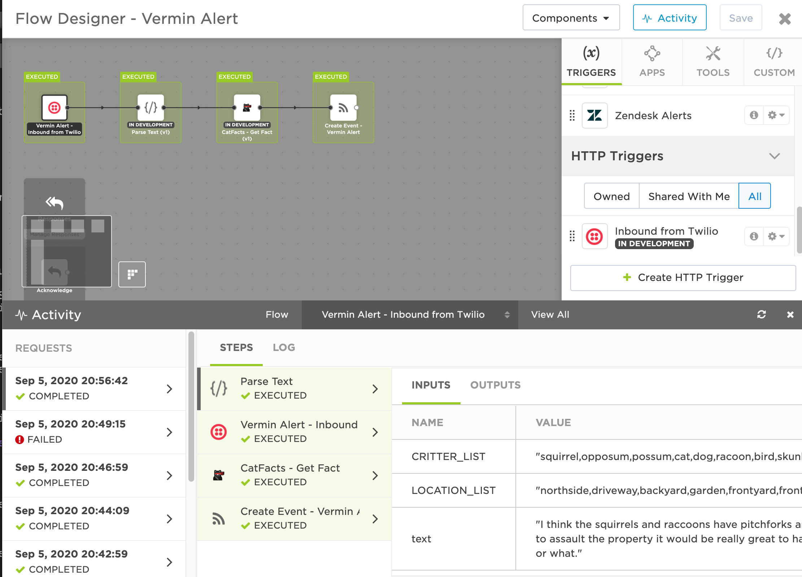</kbd>

# Fin

I hope this has been helpful - and fun! With this integration, you no longer have to worry about vermin infesting your residence. Well, if the cats ever get off the couch, of course. You can also add your user to the On Site Security group and see what the notifications look like. I highly recommend adding the xMatters mobile app, available in your local app store. 

If you are responsible for keeping any services up and running or are part of an on-call application that just isn't cutting it for you, check out the integrations available over at [xmatters.com/integrations](https://xmatters.com/integrations) and see if we have any tools your teams are using. Or, come up with your own and get it posted on our [xM Labs](https://github.com/xmatters/xMatters-Labs) repository for others to use. 

